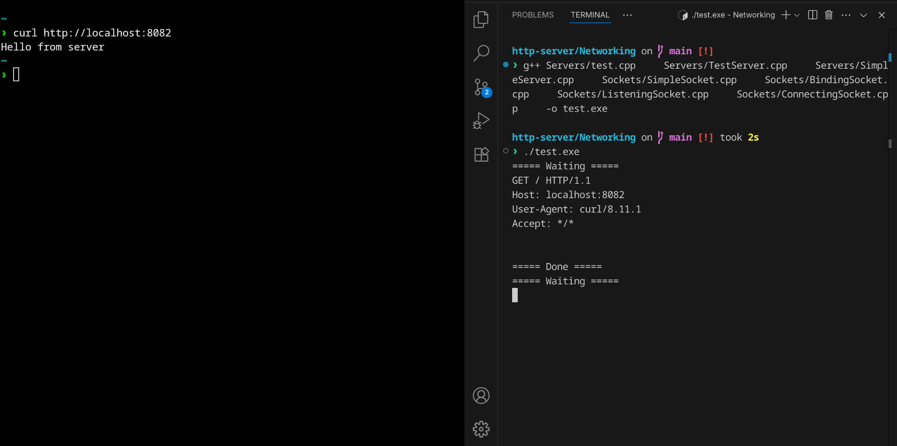
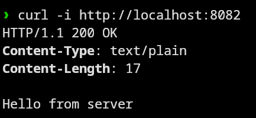

# HTTP Server in C++

This is a HTTP server implemented in C++ using raw sockets and object-oriented principles. The server listens on a specified port, accepts HTTP GET requests, and responds with a simple message.



---


##  How It Works

- `SimpleSocket` – Abstract base for all socket types.
- `BindingSocket` – Inherits from `SimpleSocket` and adds `bind()` logic.
- `ListeningSocket` – Adds `listen()` to form the server socket.
- `SimpleServer` – Abstract class defining the server lifecycle.
- `TestServer` – Concrete implementation of a working HTTP server.

The server replies to every HTTP request with:

HTTP/1.1 200 OK
Content-Type: text/plain
Content-Length: 17

Hello from server




---

##  Build & Run

```bash
g++ Servers/test.cpp \
    Servers/TestServer.cpp Servers/SimpleServer.cpp \
    Sockets/SimpleSocket.cpp Sockets/BindingSocket.cpp \
    Sockets/ListeningSocket.cpp Sockets/ConnectingSocket.cpp \
    -o test.exe

./test.exe

 ---

# Sample Output

===== Waiting =====
GET / HTTP/1.1
Host: localhost:8082
User-Agent: curl/8.11.1
Accept: */*
===== Done =====

 Learnings

   - Raw socket programming (AF_INET, SOCK_STREAM).

   - Basic HTTP protocol structure.

   - C++ virtual functions and abstraction for network layers.


